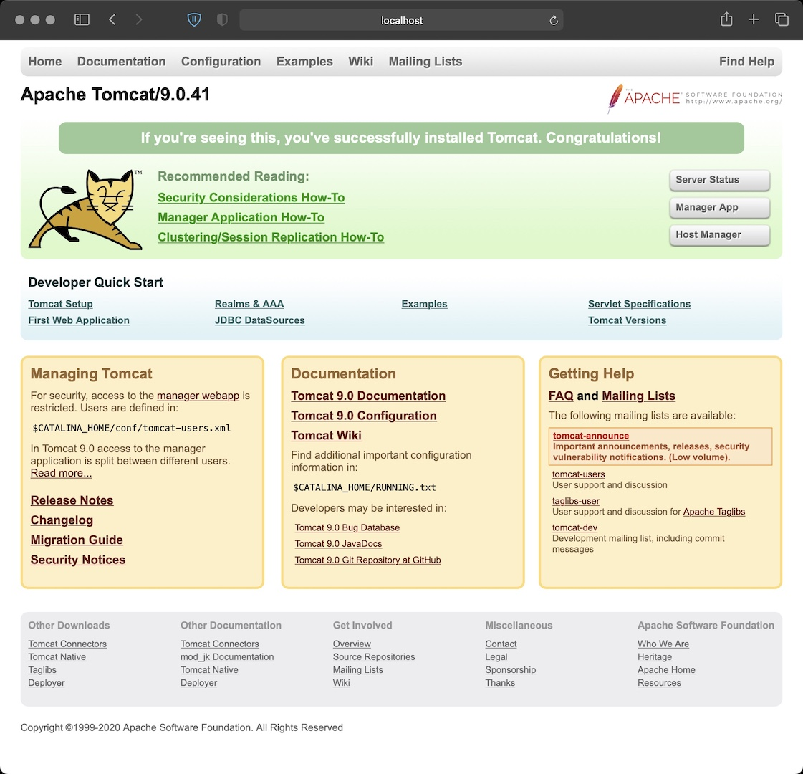

# CentOS_Tomcat_OpenJDK
A container image with Centos 7, OpenJDK 11.0.9, OpenSSL 1.1.1 and Tomcat 9.0.41 / Tomcat Native Library 1.2.26

#### Get the image from dockerhub
Get this container with:
docker pull techcasita/centos_tomcat_openjdk


#### Or build, Tag, and Push the image to dockerhub

docker build -t centos7_tomcat_openjdk .
docker tag centos_tomcat_openjdk:latest techcasita/centos_tomcat_openjdk
docker login
  Username: wolfpaulus
docker push techcasita/centos_tomcat_openjdk:latest

### Run the container

docker run --rm -it --name tc -p 8080:8080 centos7_tomcat_openjdk:latest
Open a web browser at http://localhost:8080/


- Server version name:   Apache Tomcat/9.0.41
- Server built:          Dec 3 2020 11:43:00 UTC
- Server version number: 9.0.41.0
- OS Name:               Linux
- OS Version:            4.19.121-linuxkit
- Architecture:          amd64
- Java Home:             /usr/lib/jvm/adoptopenjdk-11-hotspot
- JVM Version:           11.0.9.1+1
- JVM Vendor:            AdoptOpenJDK
- CATALINA_BASE:         /opt/tomcat
- CATALINA_HOME:         /opt/tomcat
- Loaded Apache Tomcat Native library [1.2.26] using APR version [1.4.8]
- APR capabilities: IPv6 [true], sendfile [true], accept filters [false], random [true].
- APR/OpenSSL configuration: useAprConnector [false], useOpenSSL [true]
- OpenSSL successfully initialized [OpenSSL 1.1.1  11 Sep 2018]
- Initializing ProtocolHandler ["http-nio-8080"]
- Starting Servlet engine: [Apache Tomcat/9.0.41]
- Starting ProtocolHandler ["http-nio-8080"]


docker exec -it tc /bin/bash

E.g.:
```
docker exec -it tc /bin/bash

[root@e4bbe4d3fbf5 tomcat]# cat /etc/centos-release
CentOS Linux release 7.9.2009 (Core)
[root@e4bbe4d3fbf5 tomcat]# java --version
openjdk 11.0.9.1 2020-11-04
OpenJDK Runtime Environment AdoptOpenJDK (build 11.0.9.1+1)
OpenJDK 64-Bit Server VM AdoptOpenJDK (build 11.0.9.1+1, mixed mode)
```


